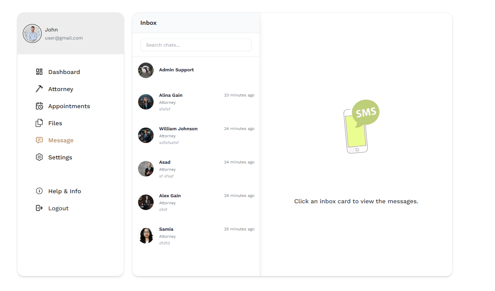
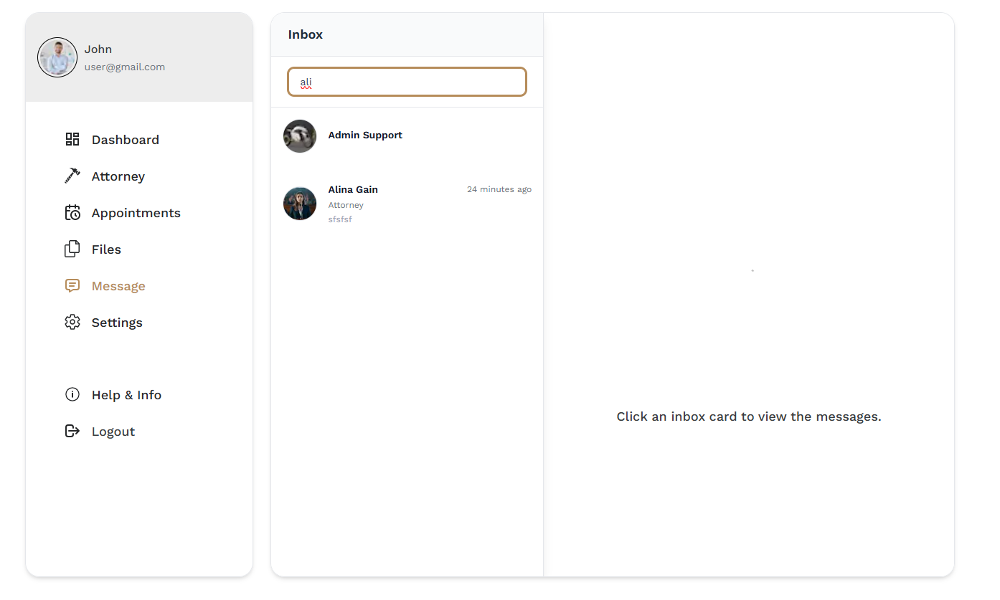
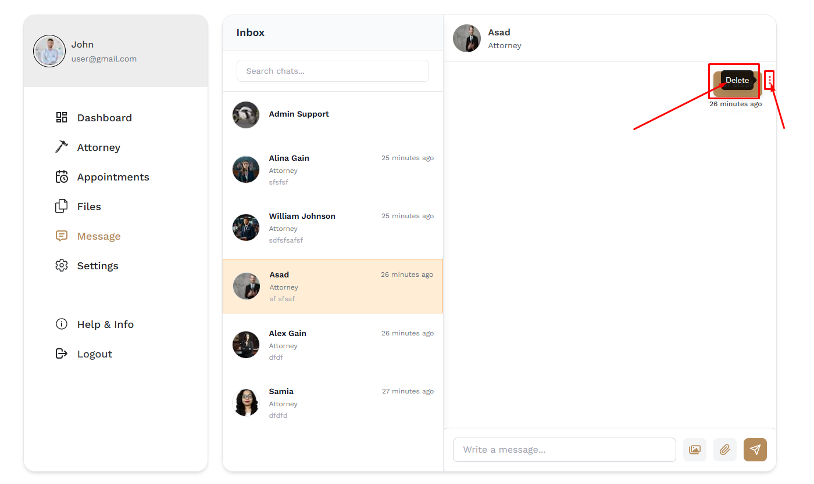
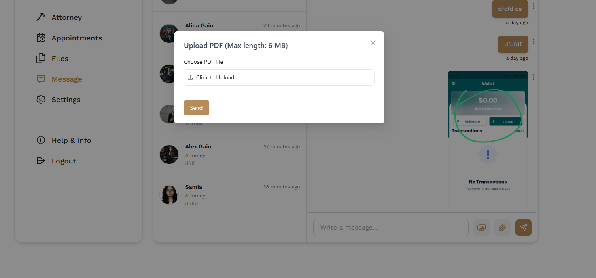
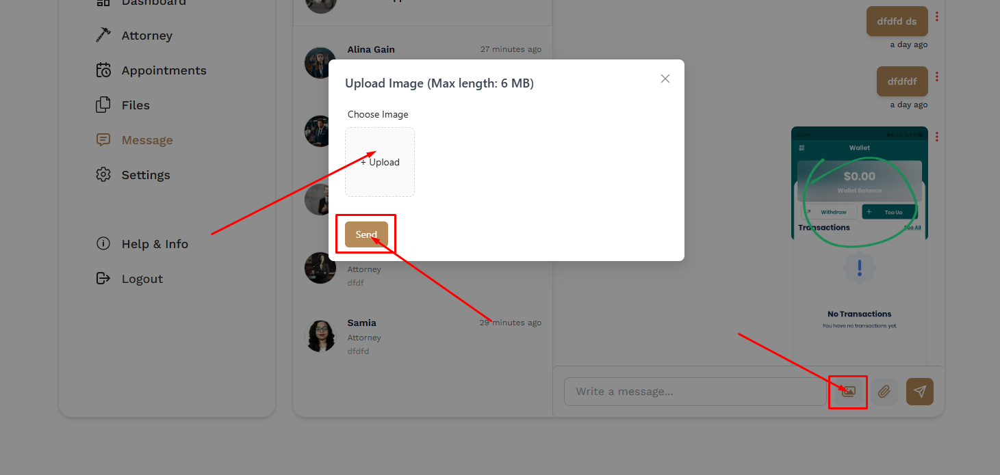
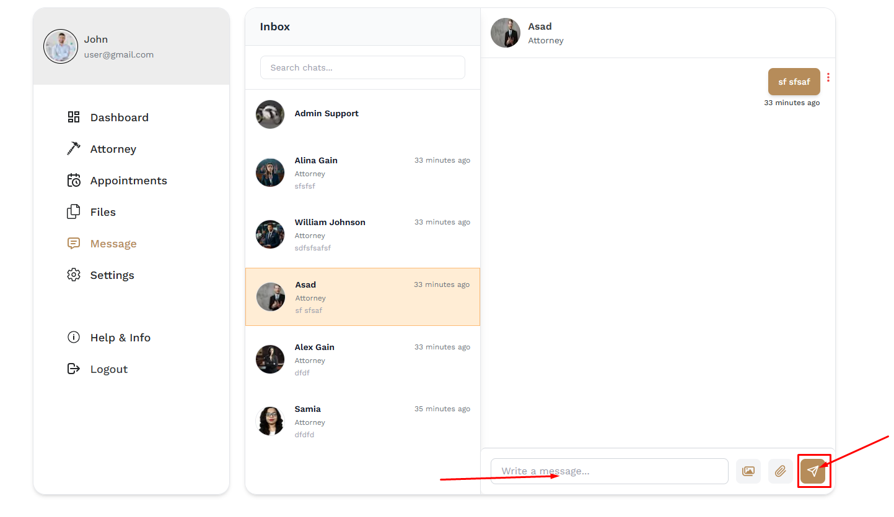

# Messages

- In this section, users can see all of the messages.

- Every user message section have default chat option of Admin support.

- The user can send messages to any user.

# Here is how to search for any user !

- The user can search for a specific user  by using the **search bar**.

# Here is how to delete a messages and upload files !

- The user can delete a specific message by clicking on the delete icon.

- The user can upload a file by clicking the upload file icon.

- The user can upload pictures by clicking the picture icon.

- The user can send a message by clicking the send icon.

