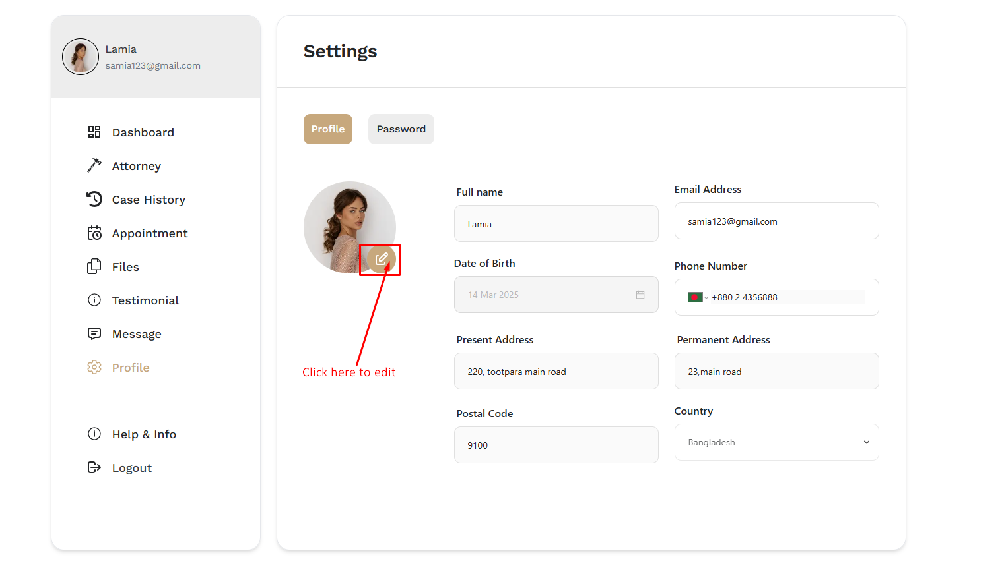

# Profile

- Clicking on **Profile**, users will be able to see their profile details setting.

- clicking on the **Edit** icon to edit their profile details.

## Here is how to change user password ?

- Users can change their password by clicking on the **password** button.

- A form will then be displayed where the user can enter their current password and confirm the new password. 

- After entering the details, the user can click on the **save** button to save the changes.

