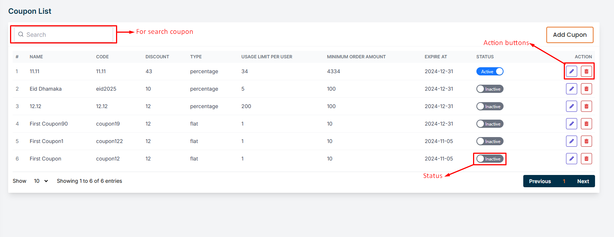
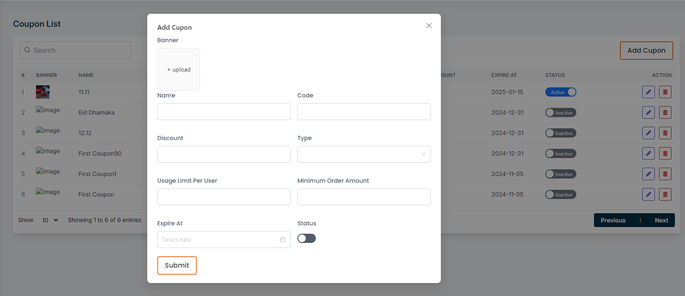
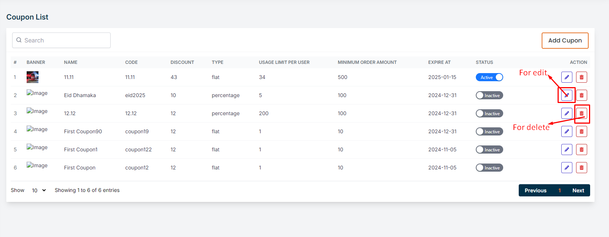

# Coupon List

- In this section, the vendor can create coupons for products to offer discounts.
- This is the coupon list page where vendor can see all the existing coupons. 
- Vendor can search a specific coupon by using the **search bar** .
- clicking on the switch**inactive** button to publish the coupon.
- Vendor can activate only one coupon at a time.

## Here is how to add a new coupon?

- To add a new coupon, click on the **Add Coupon** button. Fill all the required fields and click on the **Submit** button to save the coupon.

## Here is how to edit and delete a coupon?

- To edit a coupon, click on the **Edit** action button. A form will appear where you can edit the coupon.After editing the coupon, click on the **Submit** button to Submit the coupon.To delete a coupon, click the **Delete** action button.

