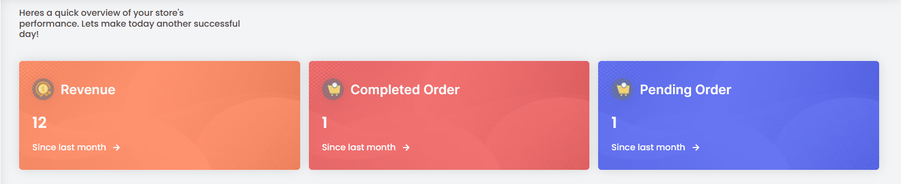
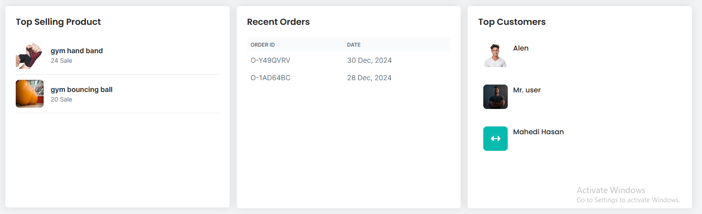

# Vendor Dashboard  

The vendor dashboard is the central hub for vendors after a successful login. It provides a comprehensive overview of key metrics and statistics essential for managing the platform effectively.

## Total static Metrics
 
### Revenue

- Displays the total amount of revenue generated.

### Completed Order 

- Reflects the total number of completed orders.

### Pending Order

- Indicates the number of pending orders.

### Top selling products

- Lists the top-selling products based on sales.
-  Includes product names and sales counts.

### Recent Orders

- Lists the most recent orders.
- In that list shows completed orders.
- Includes order UIDs and order dates.

### Top Customers

- Lists the top customers based on order counts.
- Includes customer names and order counts.
