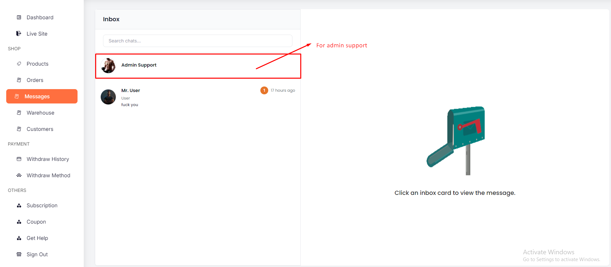
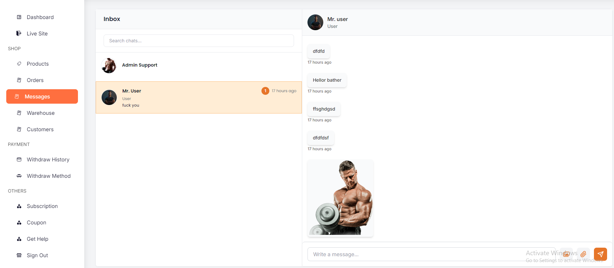
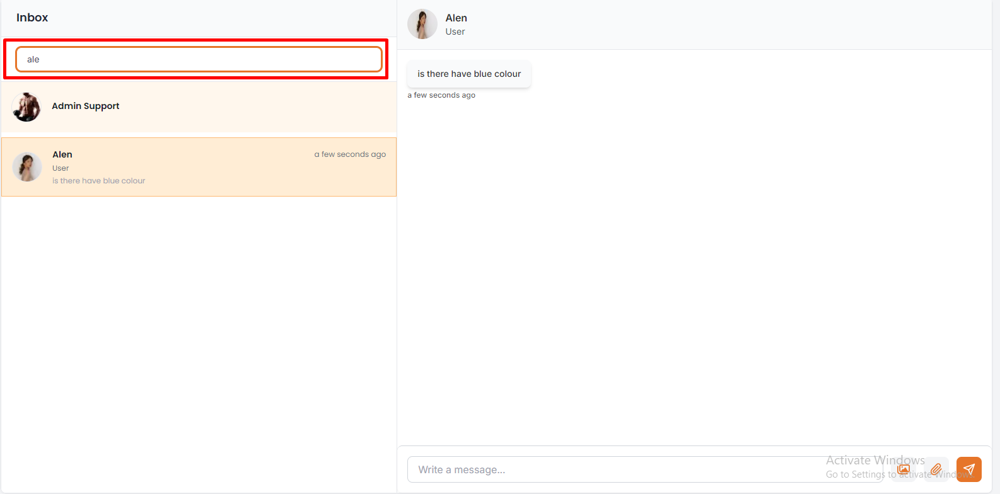
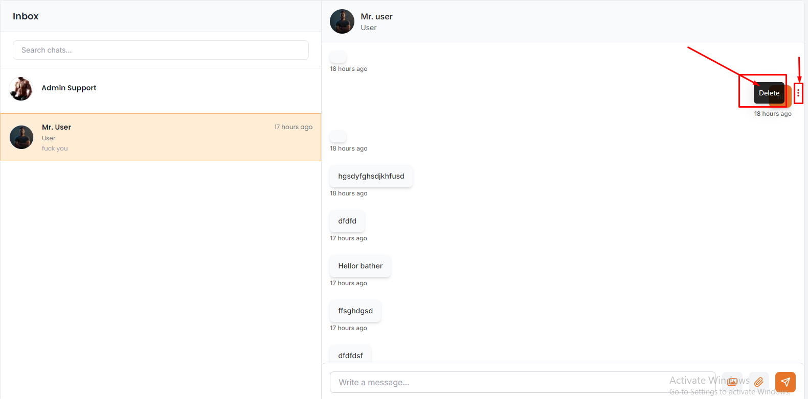
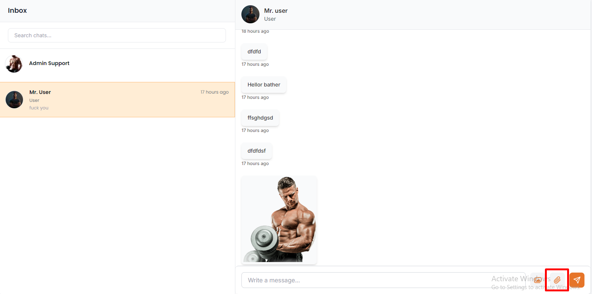
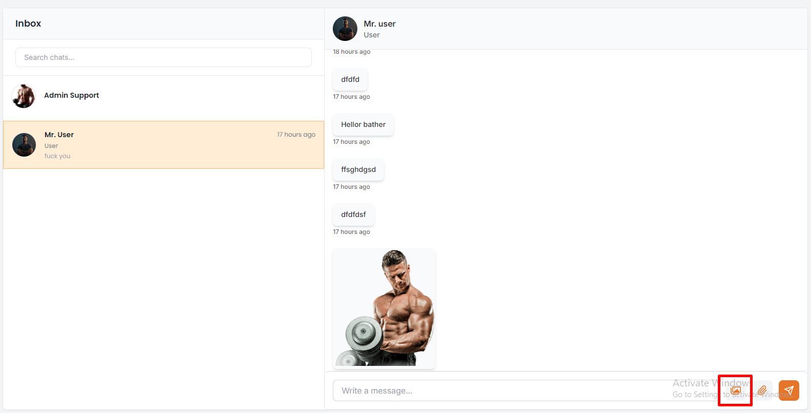

# Messages
- In this section, the vendor can view all messages from all users and admin .
- Every vendor message section have defult chat option of admin support.
- With the help of this option, the vendor can get support from admin.

# Here is how to search for any members !

- In this section, the vendor will be able to see all the existing messages and vendor can search a specific members by using the **search bar** .

# Here is how to delete a messages and upload files !
- The vendor can delete a specific message by clicking on the **delete icon** .

- The vendor can upload a file by clicking on the **upload icon** .
- you can only upload pdf files.

