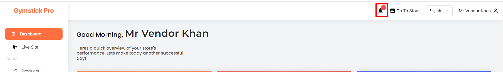

# Notification

- In this section, the vendor will be able to see all the notifications .
- vendor can  notify of all order placed by user . 

- By clicking on delete icon that will delete the notification.
- By clicking on **Mark as read** button that will mark the notification as read.
- By clicking on **Mark all as read** button that will mark all the notifications as read.

