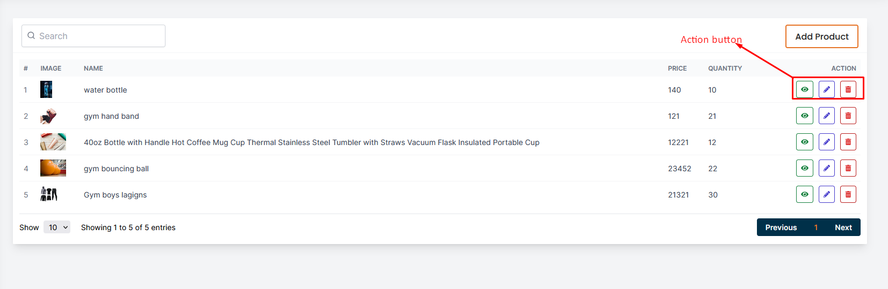
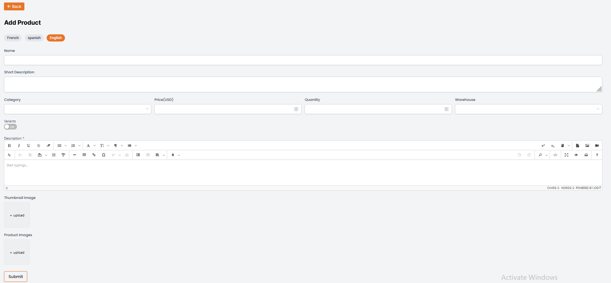
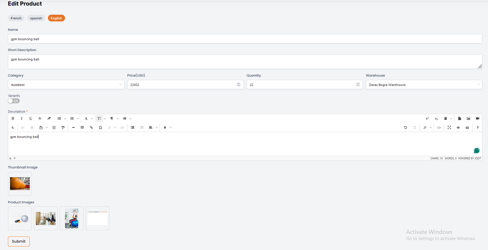
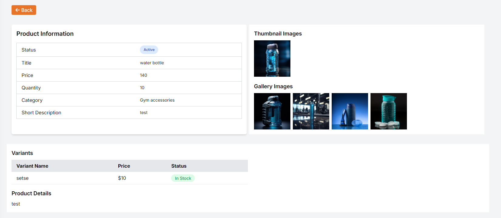
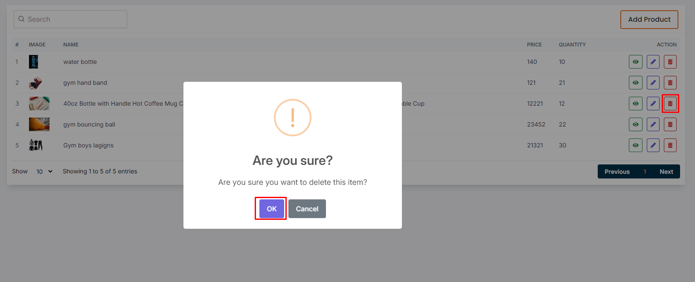

# Product

- In this section, the vendor can create products for the website and manage them.
- This is the product list page where vendor can see all the existing products.
- Vendor can search a specific product by using the **search bar** .
- clicking on the **Published** switch button to publish the product.

## Here is how to add a new product !

- To add a new product, click on the **Add new** button. Fill all the required fields and click on the **Submit** button to save the product.

## Here is how to edit a product !

- To edit a product, click on the **Edit** action icon. Update the required fields and click on the **Submit** button to save the changes.

## Here is how vendor can see product details and delete !

- To view the product details, click on the **View** action icon. The product details will be displayed in a page.

- To click on delete action button to delete the product .

