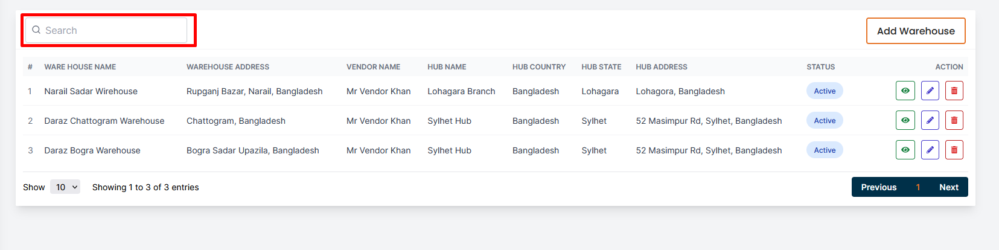
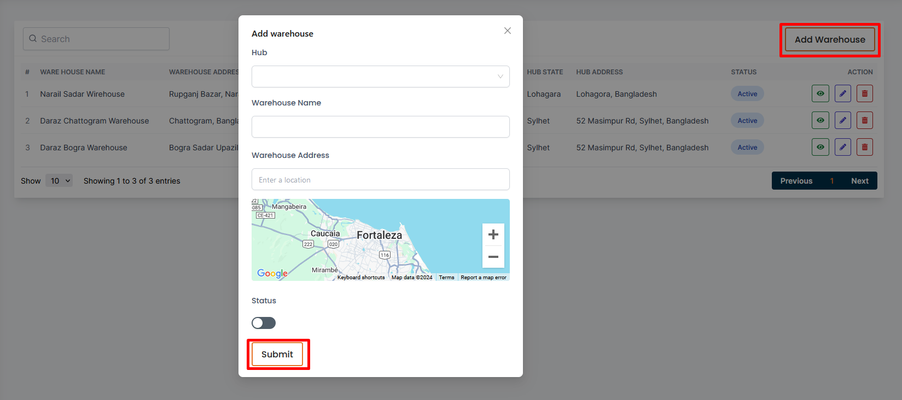
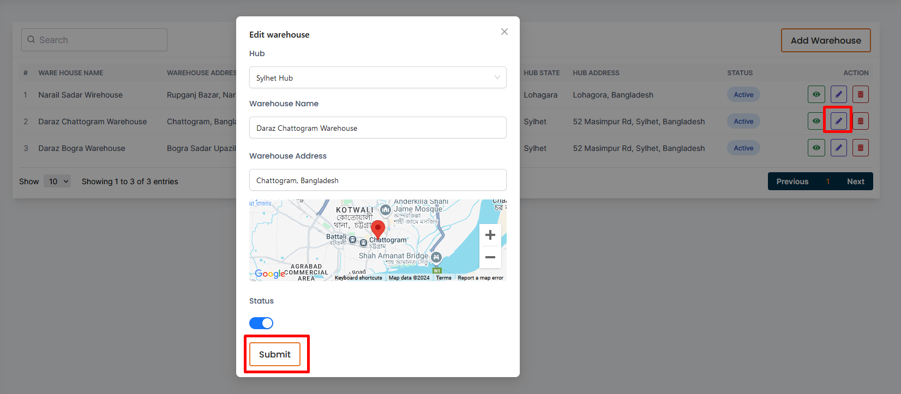
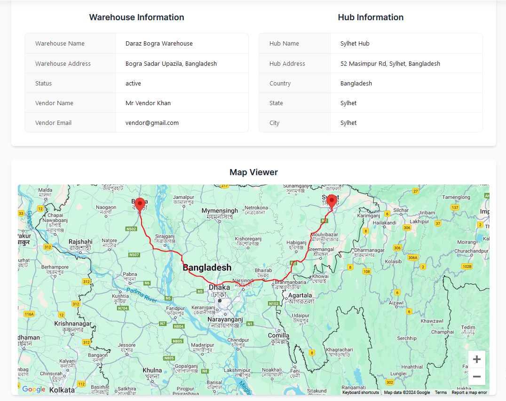
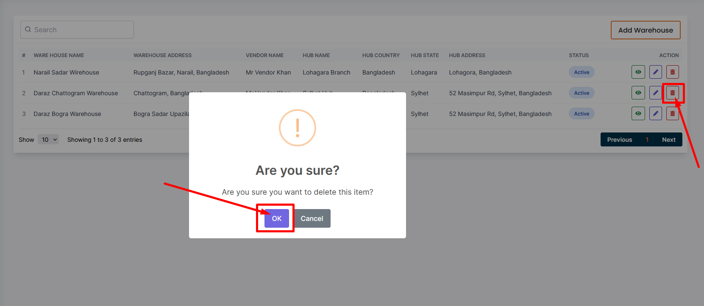

# Warehouse

- In this section vendor can see all shipping hub list. 
- Vendor can search a warehouse by using the **search bar** .
- Vendor can change status by useing toggle button .

## Here is how to add a new warehouse 

- Clicking on **Add Hub** and fill all the required fields and click on the **Submit** button to save the warehouse.

## Here is how to update a warehouse

- To edit a hub, click on the **Edit** action button. A form will appear where you can edit the hub.After editing the hub, click on the **Submit** button to Submit the warehouse.

## Here is how to view a warehouse details 

- By clicking on **view** action button to view details a warehouse .

## Here is how to delete a warehouse

- To delete a hub, click the **Delete** action button.

