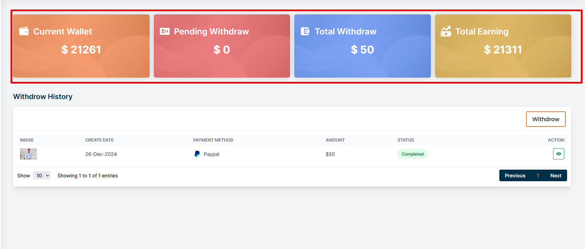
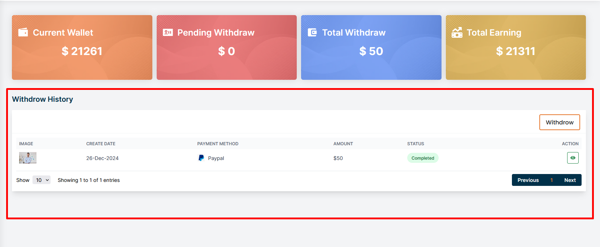
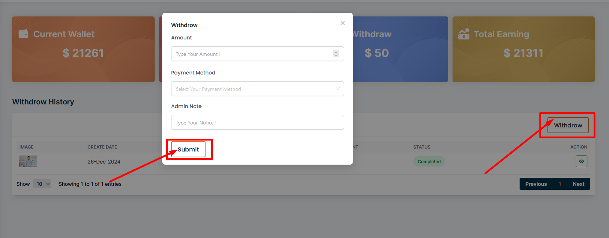

# Withdrow History

- The top section displays four key financial metrics :
# Current Wallet
- Displays the current balance available in the vendor wallet,
# Pending Withdraw
- Shows the amount currently requested for withdrawal but not yet processed.
# Total Withdraw
- Indicates the total amount the user has withdrawn so far.
# Total Earning
- Represents the total earnings accumulated by the user.

## Withdrow History 

- This section provides a detailed list of all past withdrawal transactions, including the create date, payment method, amount, status, and an action button to view more details about each transaction.

## Here is how to add withdrow request 

- Click on the **withdrow** button to add a withdrow request .

- Fill all the required fields and click on the **Submit** button to save the withdrow request .

